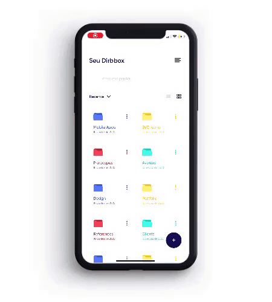

<div align="center">
  
</div>

<h3 align="center">
  Best cloud storage platform for all business and individuals to manage there data 
</h3>

<div align="center">
  
  
  
  
  
</div>

<p align="center">
  <a href="#rocket-technologies">Technologies</a>&nbsp;&nbsp;&nbsp;|&nbsp;&nbsp;&nbsp;
  <a href="#information_source-how-to-use">How To Use</a>&nbsp;&nbsp;&nbsp;|&nbsp;&nbsp;&nbsp;
  <a href="#memo-license">License</a>
</p>

<p align="center">
  
  
  
</p>

## :rocket: Technologies

- **React Native** — A framework for building native apps using React.
- **Expo** — A framework and a platform for universal React applications.
- **React Navigation** - Routing and navigation for your React Native apps.
- **Axios** - Promise based HTTP client for the browser and node.js.
- **React Native Gesture Handler** - Declarative API exposing platform native touch and gesture system to React Native.
- **Unform** - A performance focused library that helps you creating beautiful forms in React with the power of uncontrolled components performance and React Hooks.
- **Yup** - Dead simple Object schema validation.
- **Date Fns** - Modern JavaScript date utility library.
- **Expo Camera** - Provides a React component that renders a preview for the device's front or back camera.
- **Expo Document Picker** - Provides access to the system's UI for selecting documents from the available providers on the user's device.
- **Expo Image Picker** - Provides access to the system's UI for selecting images and videos from the phone's library or taking a photo with the camera.
- **Expo Font** - Allows loading fonts from the web and using them in React Native components.
- **Expo Local Authentication** - Allows you to use FaceID and TouchID (iOS) or the Biometric Prompt (Android) to authenticate the user with a face or fingerprint scan.
- **Expo Permissions** - React Native Map components for iOS + Android.
- **Mime** - Mime types for JavaScript.
- **Styled Components** - Visual primitives for the component age.
- **Async Storage** - An asynchronous, persistent, key-value storage system for React Native.
- **React Native Reanimated** - React Native's Animated library reimplemented.
- **VS Code** - Code Editing.
- **EditorConfig** - Helps maintain consistent coding styles for multiple developers working on the same project across various editors and IDEs.

## :information_source: How To Use

To clone and run this application, you'll need [Git](https://git-scm.com), [Node.js v12.18](https://nodejs.org/en/) or higher + [Yarn v1.22](https://yarnpkg.com) or higher installed on your computer and the [Dirbbox API](https://github.com/greysonmrx/dirbbox-backend). From your command line:

```bash
# Clone this repository
$ git clone https://github.com/greysonmrx/dirbbox-mobile

# Go into the repository
$ cd dirbbox-mobile

# Install dependencies
$ yarn

# Run the app
$ expo start
```

## :memo: License

This project is licensed under the MIT License - see the [LICENSE.md](./LICENSE.md) file for details.

Made with :hearts: by Greyson :wave: [See my linkedin](https://www.linkedin.com/in/greyson-mascarenhas-5a21ab1a2/)
